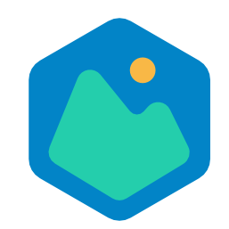
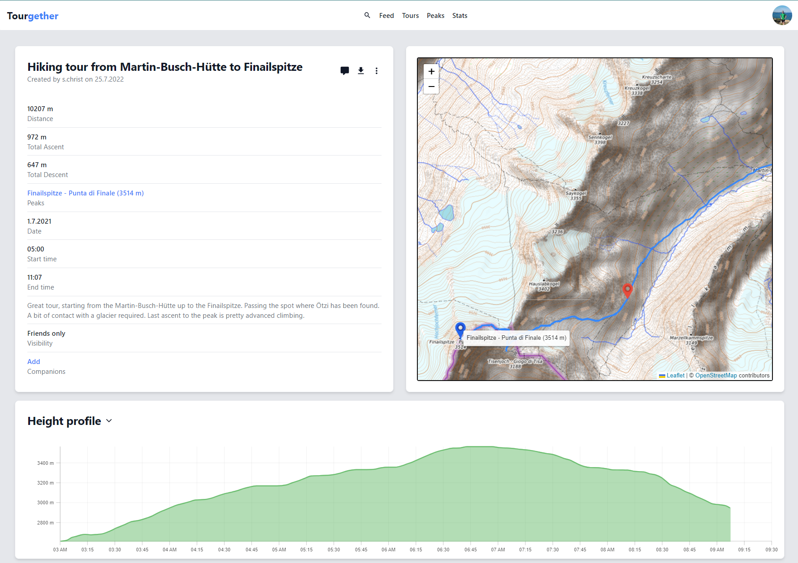
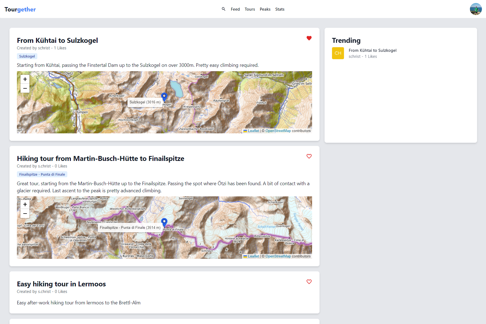
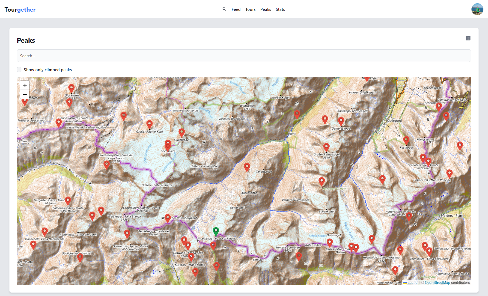
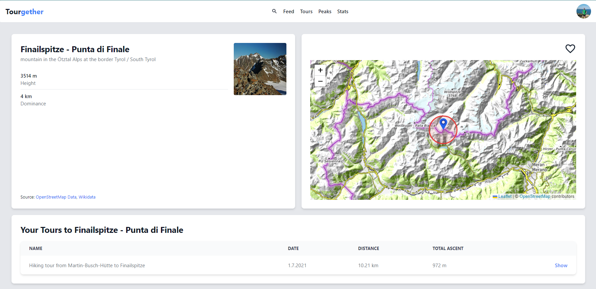

# [Tourgether](https://tourgether.eu)

## What?
I love hiking. And hiking is the most fun when you do it together with your friends. \
For this reason, Tourgether is supposed to be the social network for people who love hiking and mountaineering. Some of the features include:
- Upload your hiking tours, your stats or your images and share them with your friends.
- Get interesting insights of your hiking behavior and compete with others.
- Keep track of the peaks you would like to climb and you already did climb.
- Display metadata of peaks based on OpenStreetMap and Wikidata

## How?
To build this project, I use a variety of different technologies:
- [NextJS](https://nextjs.org/): Base framework
- [PlanetScale](https://planetscale.com/): The underlying database platform 
- [Prisma](https://www.prisma.io/): ORM for the database access
- [tRPC](https://trpc.io/): End-to-end typesafe API calls
- [Tailwind](https://tailwindcss.com/): The styling framework
- [NextAuth.js](https://next-auth.js.org/): Authentication library for NextJS.
- [Auth0](https://auth0.com/): My authentication provider of choice
- [Leaflet](https://leafletjs.com/): The awesome library that makes displaying maps easy
- [AWS S3](https://aws.amazon.com/de/s3/): For uploading gpx files and images
- [Vercel](https://vercel.com): For building and hosting

## Screenshots
 \
Tour details screen

 \
Your feed

 \
Search peaks on map

 \
Peak details screen


## Contribute / Run it yourself

To run this project by yourself, there is a bit of setup required, as there are some environment variables that need to be set. Add the following values to a `.env` file located in your project root.

```
DATABASE_URL='{YOUR_DATABASE_URL, recommended to use PlanetScale}'
AUTH0_CLIENT_ID={YOUR_AUTH0_CLIENT_ID}
AUTH0_CLIENT_SECRET={YOUR_AUTH0_CLIENT_SECRET}
AUTH0_ISSUER={YOUR_AUTH0_DOMAIN}

AWS_BUCKET_REGION={REGION_OF_YOUR_AWS_BUCKET}
AWS_BUCKET_NAME={NAME_OF_YOUR_AWS_BUCKET}
AWS_BUCKET_ACCESS_KEY_SECRET={SECRET_OF_YOUR_AWS_BUCKET}
AWS_BUCKET_ACCESS_KEY_ID={ACCESS_KEY_ID_OF_YOUR_AWS_BUCKET}
```

After setting these environment variables and after your initial `npm install`, make sure to execute `npx prisma db push` to update the schema in your database.

Auth0 and PlanetScale offer generous free tiers, which should be enough for development purposes.
AWS S3 bucket is pretty cheap depending on how much you upload (Uploading data is not required). 

This repository comes with the peaks already extracted from OpenStreetMaps. To insert them into your db run `npm run seed`.

## Notes
All peak data that is shown in the app is provided by OpenStreetMap and it's contributors. The app is meant to be a fun tool and does by no means claim to be correct or valid. 